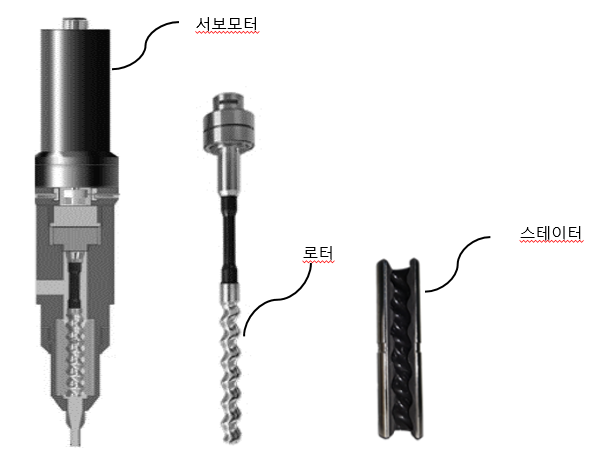

# 1.2 모노펌프 시스템

### <mark style="color:green;">1. 전체 시스템 구성 </mark>

    하기의 그림은 전체 시스템 구성을 나타냅니다. 로봇 제어기로 모노펌프 건을 직접 제어할 수 있습니다.

### <mark style="color:green;">2. 모노펌프건 구성</mark>

    하기의 그림은 모노펌프 건의 구성을 나타냅니다. 서보모터, 로터, 스테이트로 구성되어 있습니다.

