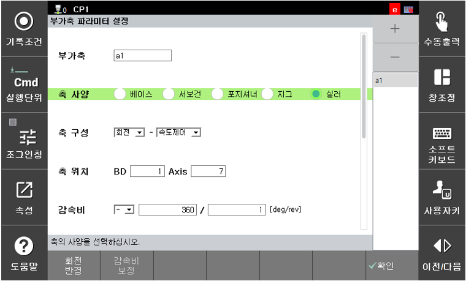

# 2.1 부가축 파라미터 설정

실러 건을 로봇의 부가축으로 직접 제어할 때는 축 사양을 <실러>로 설정합니다. 또한 모노펌프 건의 토출량(cc/s)은 해당 모터의 회전속도(rpm)에 따라 결정되기 때문에 해당 축의 속도를 제어해야 합니다. 이에 따라 축 구성을 <속도제어>로 설정합니다.

감속기를 사용하지 않고 모터와 직결한다면 감속비를 360:1으로 설정합니다. 이는 모터 1회전에 실제 기구는 360deg 회전함을 의미합니다. 또한 토출이 진행되는 방향을 고려하여 감속비 부호를 설정합니다.