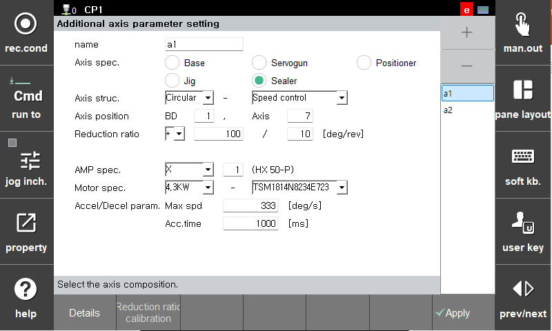
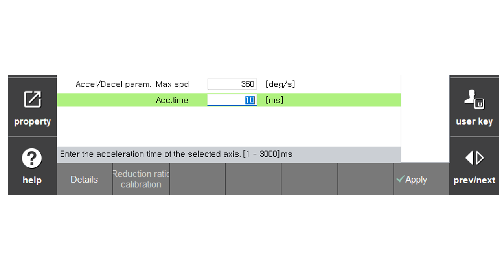

# 2.1 额外轴参数设置

当直接将封闭枪作为机器人的额外轴进行控制时，将轴类型设置为 <Sealer>。由于单泵枪的排出量（cc/s）由电机速度（rpm）决定，因此必须控制轴速度。因此，将轴配置设置为 <Speed control>。

- 如果电机直接与无齿轮减速器耦合，则将减速比设置为 360:1。这意味着一个电机旋转对应于机制的 360°。如果存在减速器，则设置减速器减速比，并根据排出方向设置比率的符号。  

- 加速时间参数决定达到最大速度的时间，而减速时间决定从最大速度到停止的时间。如果这些值对于单泵枪来说过大，排出启动/停止以及回吸/补充的响应将会延迟，从而使实现所需质量变得困难。  
因此，将这些值设置得尽可能小以提高操作速度。