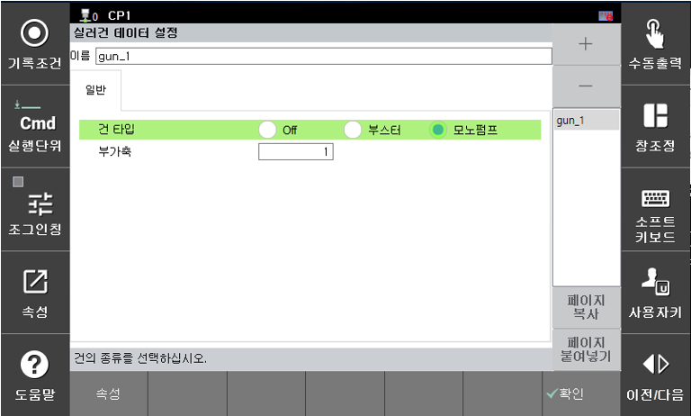

# 2.2 실러건 데이터 설정

[시스템] -> [4: 응용 파라미터] -> [20: 실링] -> [1: 실러건 설정] 화면에 집입합니다.
실러건에 따른 건의 타입과 부가축을 설정합니다. “+”버튼에 의한 건의 추가, “-”버튼에 의한 건의 삭제가 가능합니다.

- 건 타입 : 모노펌프 건으로 설정합니다.
- 부가축 : 해당 건의 부가축 번호를 설정합니다.

[속성] 버튼에 의한 상세한 건의 설정이 가능합니다.
