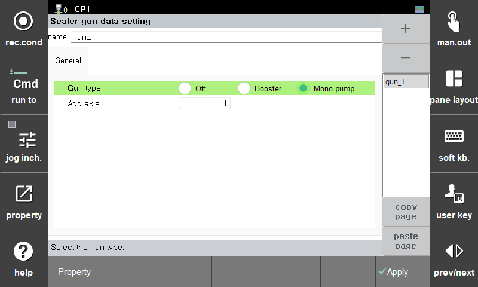

# 2.2 Sealer gun data settings

Go to [System] -> [4: Application Parameters] -> [20: Sealing] -> [1: Sealer Gun Settings].
Set the gun type and additional axis for each sealer gun. You can add a gun with the "+" button and remove one with the "-" button.

- Gun type: set to Monopump gun.
- Additional axis: set the axis number for the gun.

Detailed gun settings are available via the [Properties] button.