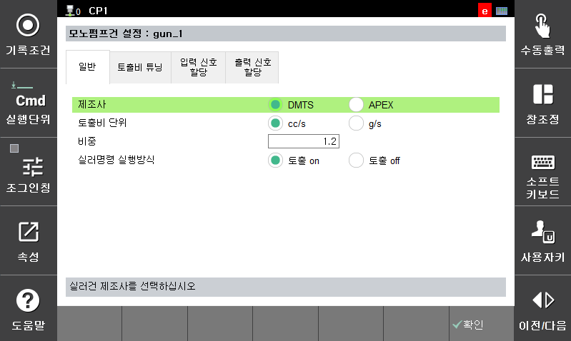

# 2.3.1 General

General settings related to the monopump gun.

- Manufacturer: select the monopump gun manufacturer.
- Discharge unit: choose the unit used for the discharge interface.
- Specific gravity: set the specific gravity of the sealer material.
- Sealer command execution mode: The m_sealer on/off commands in the job program execute discharge. If <Discharge off> is selected, the job program runs without performing actual discharge.