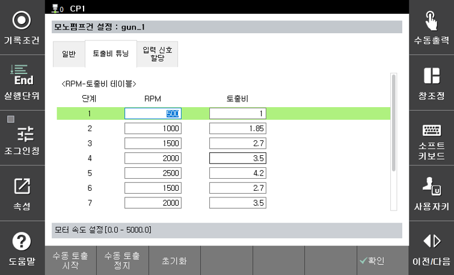
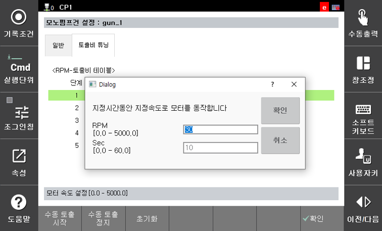
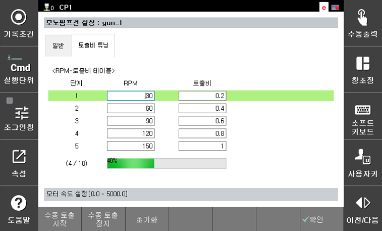
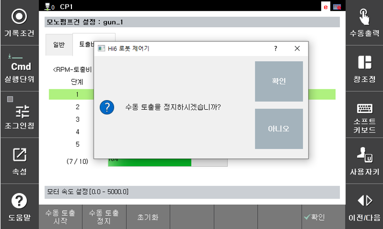
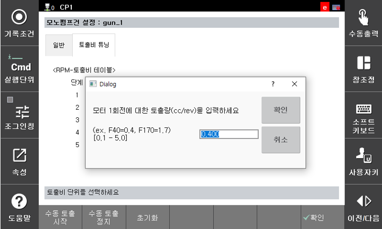

# 2.3.2 토출비 튜닝

모노펌프 건의 모터 회전속도(rpm)에 따른 토출비(cc/s)를 설정합니다. 최대 10단계의 구간으로 나누어 설정이 가능하도록 구성되어 있습니다.

[수동 토출 시작] 버튼을 이용하여 해당 모노펌프 건의 모터를 지정된 속도로 설정된 시간동안만 구동할 수 있습니다.

하기의 그림은 수동 도출 실행에 대한 진행 상태를 표시합니다.

[수동 토출 정지] 버튼을 이용하여 수동 토출 실행을 강제로 정지시킬 수 있습니다.

[초기화] 버튼을 이용하여 모터 1회전에 대한 토출량을 기준으로 토출비를 초기값으로 설정할 수 있습니다.

