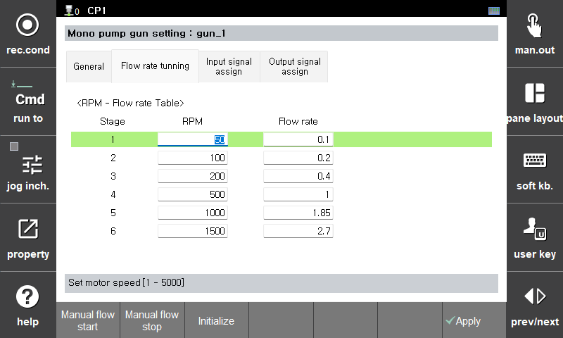
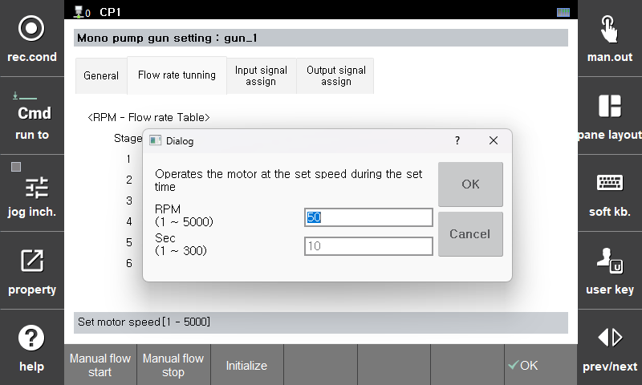
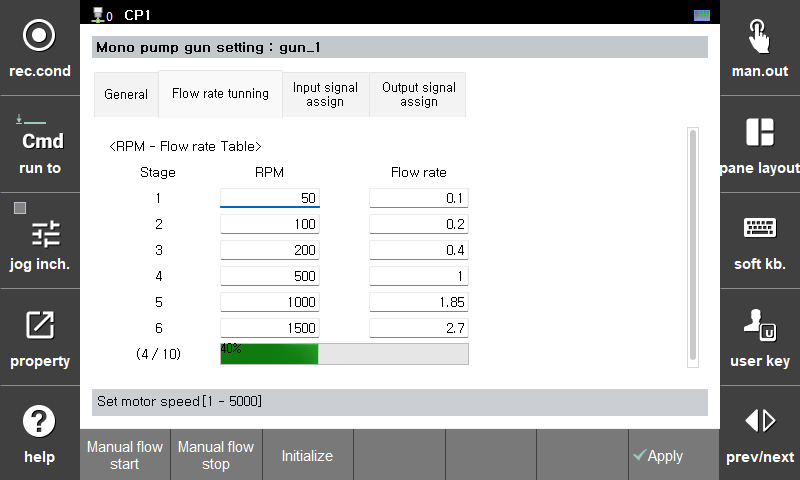
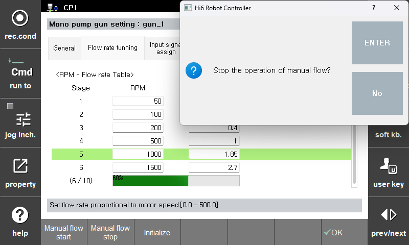
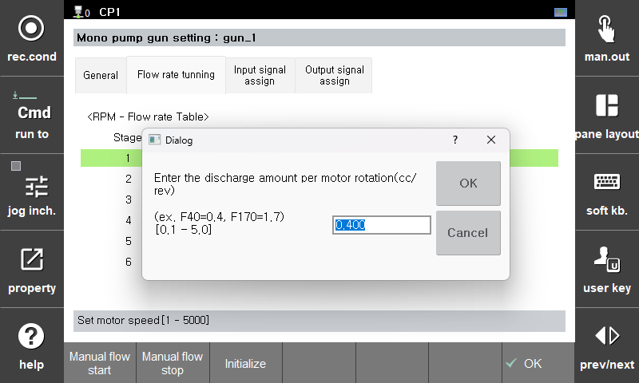

# 2.3.2 Flow rate tuning

Set the discharge rate (cc/s) according to the monopump gun motor speed (rpm). It can be configured in up to 6 segments. 
The flow rate is determined by measuring the amount discharged at a specified speed for a specified time on a scale and calculated as: "measured value (g) * specific gravity / time." 

Use the [Start manual discharge] button to run the monopump gun motor at the specified speed for the set time.

The following figure shows the status during manual discharge execution.

Use the [Stop manual discharge] button to forcibly stop manual discharge.

Use the [Initialize] button to set the flow rate initial values based on the amount per one motor revolution.

