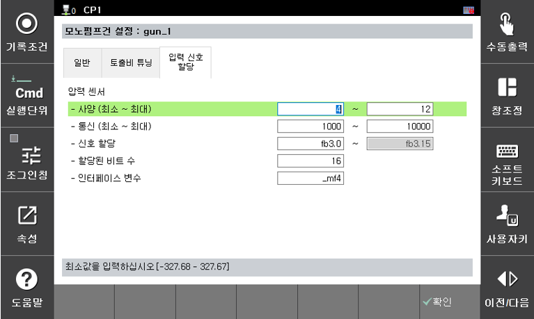
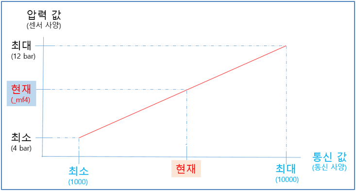

# 2.3.3 입력 신호 할당

모노펌프 건과 관련하여 로봇제어기로 입력되는 신호에 대한 설정입니다.

- 압력 센서 : 압력 센서 입력에 대한 정보를 설정합니다.  
	- 사양(최소 ~ 최대) :압력 센서 사양의 최소값과 최대값을 설정합니다.  
	- 통신(최소 ~ 최대) :압력 센서의 데이터가 통신으로 전달될 때 이에대한 최소값과 최대값을 설정합니다.  
	- 신호 할당 :압력 센서에서 입력되는 신호를 설정합니다.  
	- 할당된 비트 수 : 압력 센서에서 사용되는 신호의 비트수를 설정합니다.  
	- 인터페이스 변수 : 계산된 압력값의 인터페이스를 위한 변수값을 설정합니다. 여기서는 현재 입력되는 압력으로 계산된 압력값이 _mf4의 메모리에 대입됩니다.  

       

