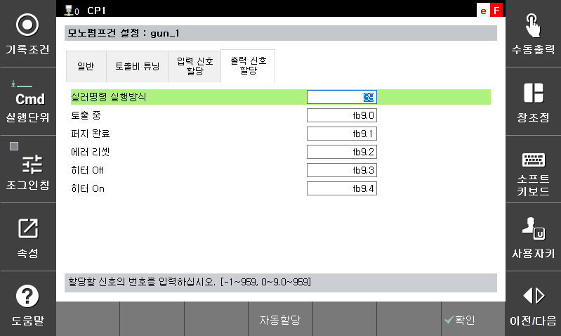

# 2.3.4 输出信号分配

与单泵枪相关的来自机器人控制器的信号输出设置。

[Auto assign] 按钮可以根据选择的封口机制造商自动设置信号。  

- 封口机命令执行模式：作业程序中的 m_sealer 开/关命令执行放电。然而，根据用户设置或输入信号状态，作业程序可能在不执行实际放电的情况下运行。此输出指示是否正在执行实际放电。   
- 放电：单泵枪输出其当前是否正在放电。  
- 错误重置：在发生错误时用于重置封口机控制面板的输出。R1（错误重置）操作或“错误/警报信号清除”输入会导致 1 秒的 ON 脉冲输出以进行重置。  
- 其他信号：使用这些信号通过机器人语言发送封口机面板状态。  