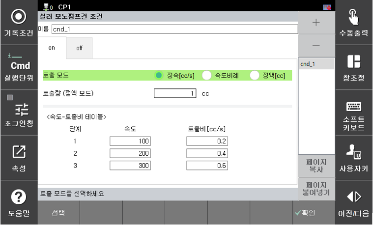
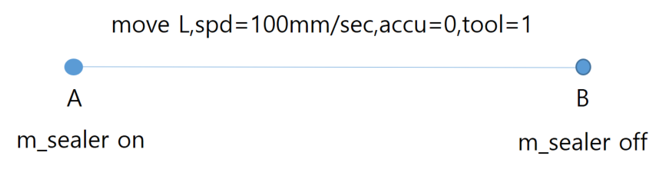

# 3.2.1 토출 시작 (m_seler on)

m_sealer on 명령을 수행할 때 토출 조건을 설정합니다.

- 토출 모드 : 정속, 속도비례, 정액의 토출 모드를 선택합니다. 속도비례는 로봇의 툴 끝 이동속도에 따라 자동으로 토출비가 결정됩니다.
- 토출량(정액 모드) : 토출 모드가 정액인 경우 토출량을 설정합니다.
- <속도-토출비 테이블> : 토출 모드가 속도비례인 경우 로봇 툴 끝의 이동속도(mm/s)에 따른 토출비를 설정합니다. 최대 5단계의 구간으로 나누어 설정이 가능하도록 구성되어 있습니다. 설정하는 방법은 로봇 Lock을 유효로 설정한 상태에서 하기의 그림과 같이 m_sealer on ~ off 구간을 정속 모드로 실행하여 토출량을 확인합니다. 동일한 토출량이 되었을 때 해당 로봇속도에 따른 토출비를 설정합니다.

  

