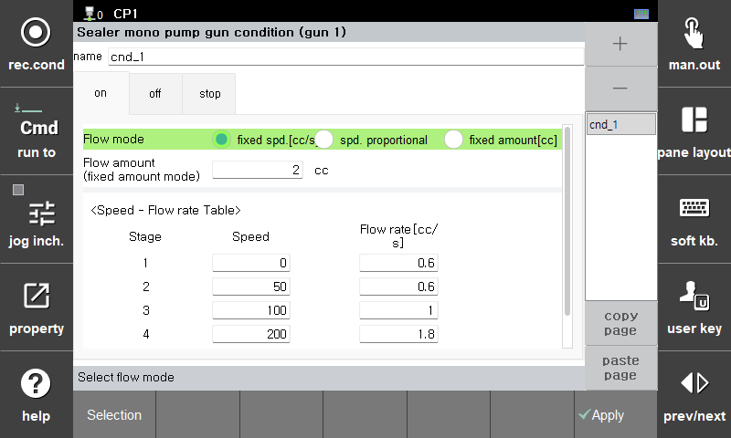
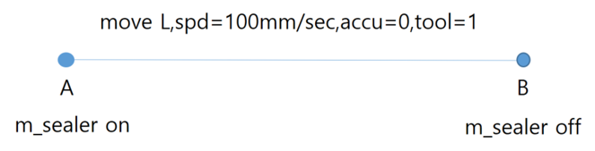
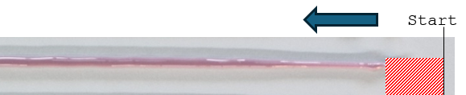
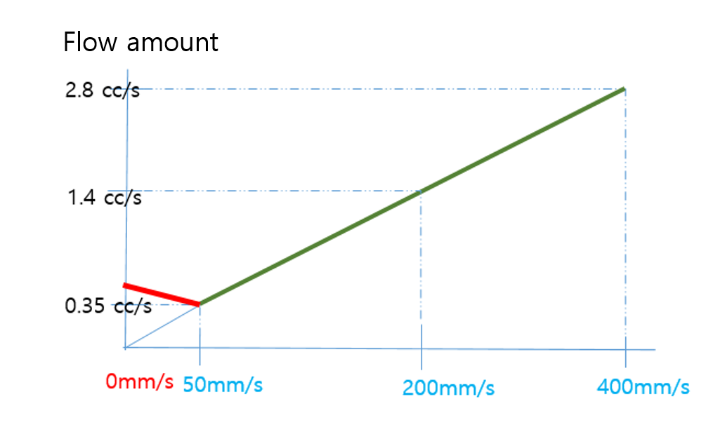

# 3.2.1 排放启动 (m_sealer 开)

设置 m_sealer 开命令的排放条件。

- 排放模式：选择恒定、速度比例或固定量排放模式。速度比例会根据工具尖端速度自动确定流量。
- 排放量（固定模式）：选择固定量模式时设置排放量。
- <速度-流量表>: 对于速度比例模式，根据工具尖端速度（mm/s）设置流量。最多可配置 5 个段。要设置它，请启用机器人锁定并以恒定模式运行 m_sealer 开~关区域以测量排放，然后设置与观察到的相同排放量对应的机器人速度的流量。

  

  如果在低速度下应用机器人速度与流量之间严格的比例关系，启动时可能会错过排放，如下所示。  
  

  为了补偿起始时排放不足，请操作以使在低速 0 ~ 50 mm/s 时也会发生一定的最小排放量，如下所示。  
  