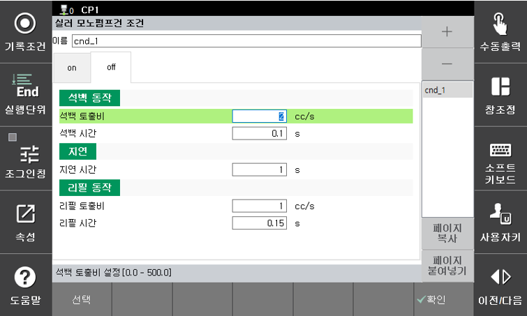

# 3.2.2 토출 종료 (m_seler off)

m_sealer off명령문 수행시 석백 및 리필을 위한 동작 조건을 설정합니다. 

- 석백 토출비 : 석백 동작을 위한 토출비를 설정합니다.
- 석백 시간 : 석백 동작 시간을 설정합니다.
- 지연 시간 : 석백과 리필 사이에 대기 시간을 설정합니다.
- 리필 토출비 : 리필을 위한 토출비를 설정합니다.
- 리필 시간 : 리필 동작 시간을 설정합니다.

