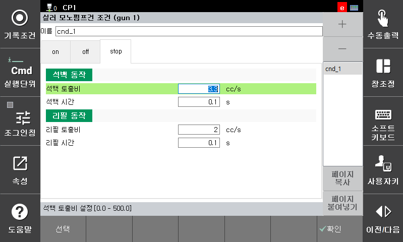

# 3.2.3 정지/재기동 (stop/restart)

정지나 비상정지 입력으로 로봇이 정지하고 재기동할때 석백 및 리필을 위한 동작 조건을 설정합니다.  
정지시에는 석백 동작을 수행하여 정지 위치에서 실러가 뭉치는것을 방지합니다.  
재기동시는 토출 누락을 방지하기 위해 리필 동작 수행 이후에 로봇이 이동을 시작합니다. 

<정지>
- 석백 토출비 : 석백 동작을 위한 토출비를 설정합니다.
- 석백 시간 : 석백 동작 시간을 설정합니다.

<재기동>
- 리필 토출비 : 리필을 위한 토출비를 설정합니다.
- 리필 시간 : 리필 동작 시간을 설정합니다.

