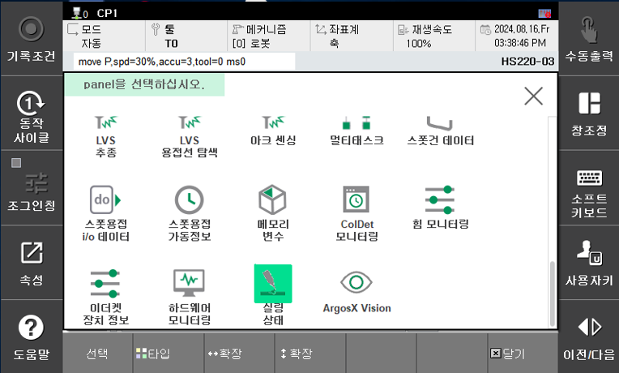
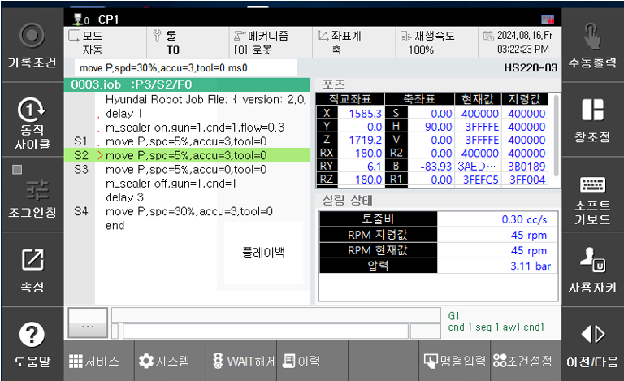

# 4.1 실링 상태

실러 상태를 확인하기 위한 모니터링창에 대해서 설명합니다. [창조정]에서 실링 상태를 선택합니다.

- 토출비 : 현재 토출되는 토출비를 표시합니다.
- RPM 지령값 : 토출비에 해당하는 실러 모터의 RPM 지령값입니다.
- RPM 현재값 : 실러 모터의 RPM 현재값을 표시합니다.
- 압력 : 압력 센서에 의해 입력되는 압력값을 표시합니다.

