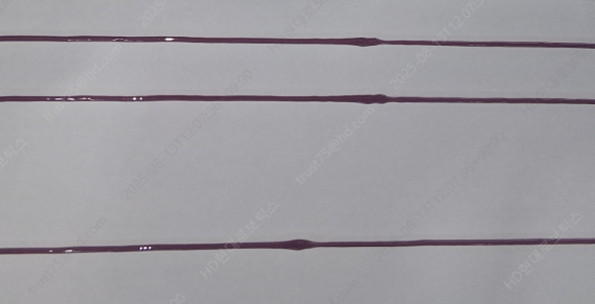

# 5.1 Stop/Restart in sealer ON region

Explains monopump gun behavior when the robot stops/restarts in a sealer ON region.

- Stop: perform suck-back for the stop condition to prevent sealer clumping at the stop position.
- Restart: the robot starts moving after performing the stop-condition refill to prevent missed discharge.


Reference
- [3.2.3 Stop/restart](../3-command-condition/2-condition/3-stop-restart.md) 
- System variables ([_sealing.stop_seq_exe_offset_time](./4-system-var.md))
