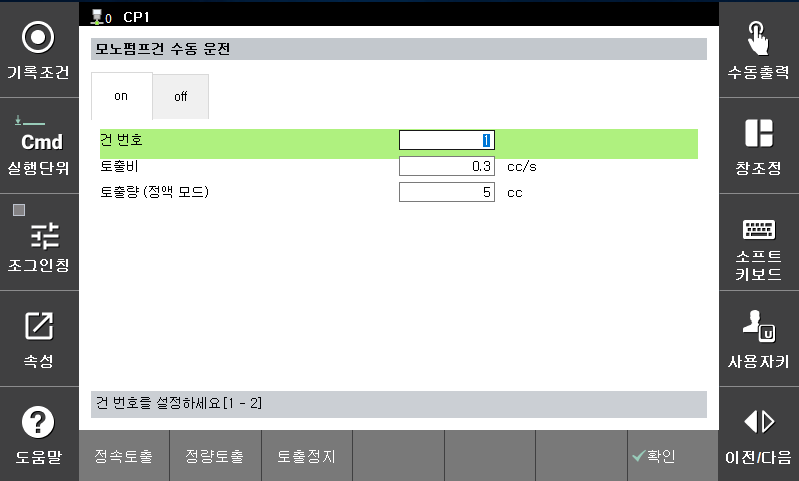
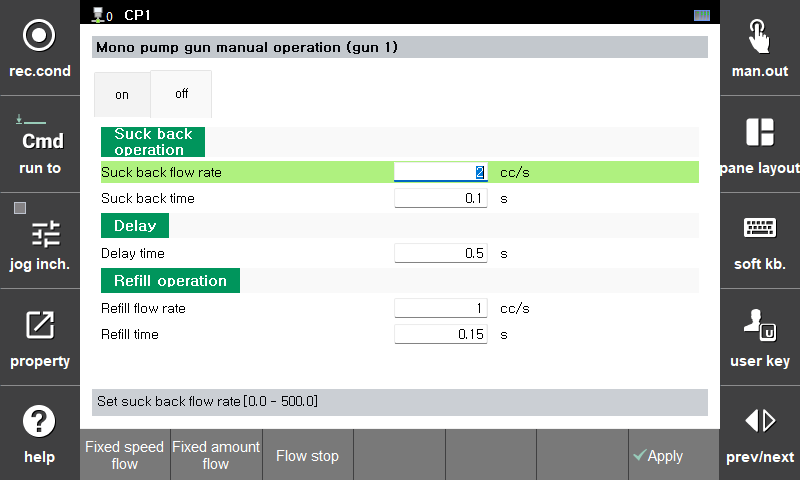

# 5.2 手动操作 (R371)

您可以从执行 [R371: 密封剂手动操作] 时显示的屏幕手动操作单泵枪。

- 流量：设置手动操作的流量。  
- 排放量：设置定量排放的排放量。  

- 恒定排放  
以设置的流量开始排放。使用 [停止排放] 按钮停止排放。  
- 定量排放  
以设置的流量开始排放，并在达到设置的数量时自动停止。您可以使用 [停止排放] 按钮强制停止排放。  
- 停止排放  
用于停止排放。  


停止排放时，始终根据 [off] 选项卡中设置的回吸和补充条件执行操作。
