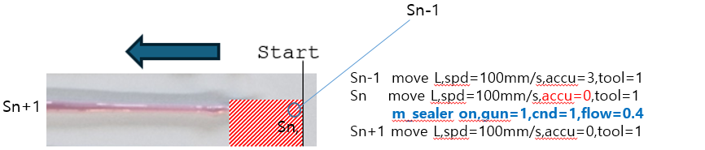
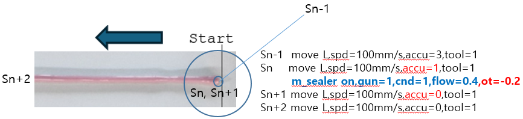

# 5.6 작업 프로그램 구성

모노펌프 건으로 토출의 시작 시점과 종료 시점을 보다 쉽게 맞추기 위한 작업 프로그램 구성 방법입니다.  

일반적으로 사용하는 작업 프로그램 형태를 사용한다면 하기의 그림과 같이 토출의 시작/종료 시점에서 누락이 발생하거나 토출량이 부족한 현상으로 나타납니다.  

상기 현상을 보완하기 위한 방법으로 하기의 그림과 같이 토출전 스텝과 토출후의 스텝을 동일한 위치로 기록한 상태에서 토출후의 스텝에는 accu를 0으로 설정하고 토출전 스텝에는 accu를 1로 설정합니다. 이후에 m_sealer on 명령문에서 ot나 od 명령문을 사용하여 명령문을 실행하는 시점을 조정합니다.

토출 종료 지점에서도 동일한 방식으로 명령문을 구성하여 사용합니다. 
